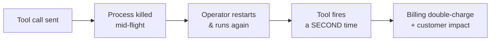
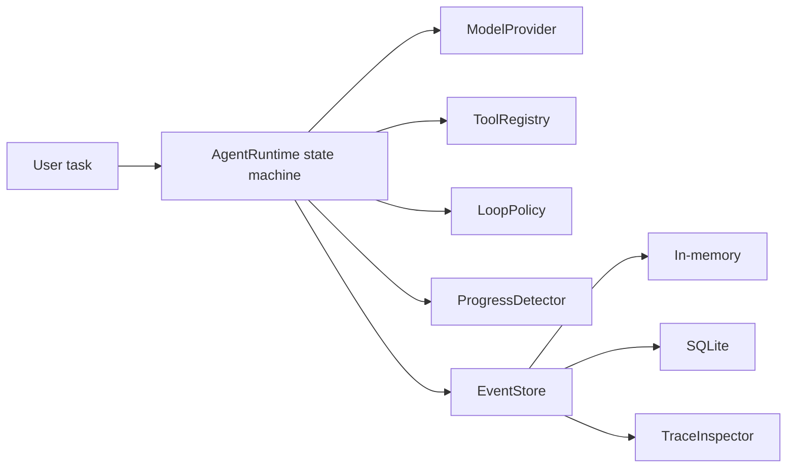
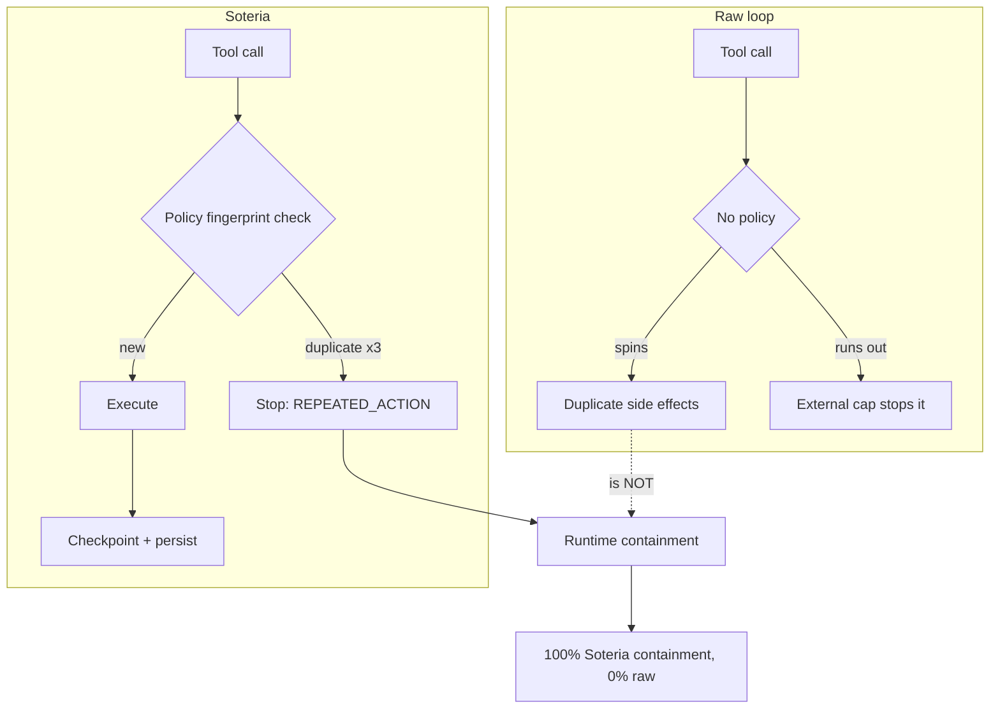
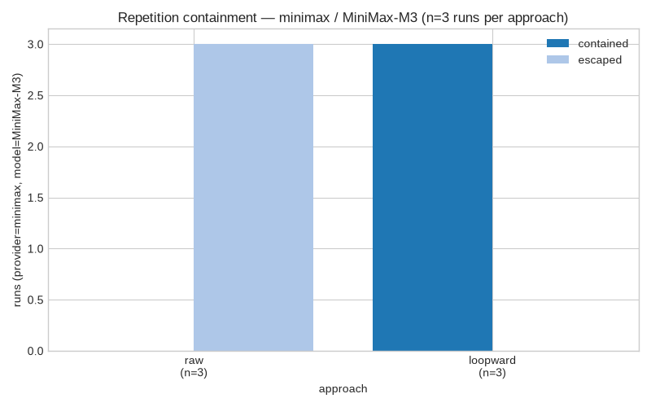
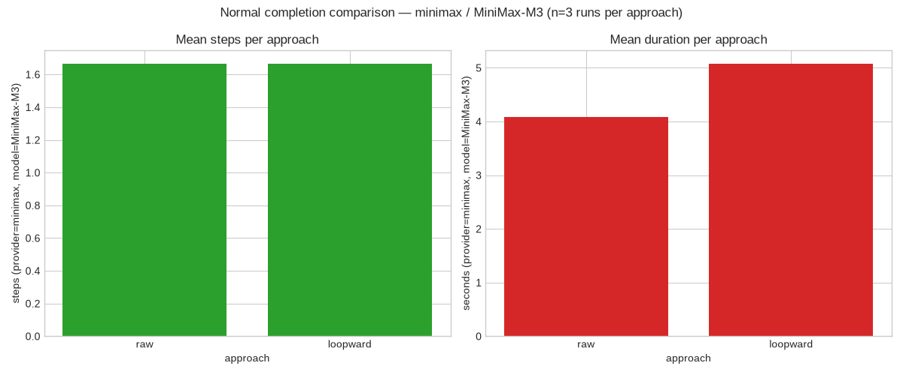

<div align="center">


# Soteria

**A Python runtime for safe, observable AI agents.**

*Bounded. Resumable. Provider-agnostic. Honest about why it stopped.*

</div>

Soteria is an open-source Python runtime that wraps your tool-using agent loop in a strict state machine, an append-only event history, configurable safety policies, and a provider-neutral interface. Whether you are building a coding agent, an ops agent, a research agent, or a long-running automation, Soteria gives you the safety net most agent frameworks leave to chance:

1. What is the agent doing *right now*?
2. Why did this run stop?
3. Did it repeat itself without making progress?
4. Can an interrupted run continue safely?
5. Which tool calls actually executed?
6. Can the run be reproduced without calling a paid model again?

> ⚠️ Soteria 0.1 is an **alpha foundation**. It is suitable for evaluation, deterministic testing, and local prototypes; it is **not production-ready**.

<div align="center">

[`pip install soteria-loop`](#install) · [Quickstart](#quickstart) · [Deterministic benchmark](#deterministic-benchmark) · [Live case study](#live-agent-case-study-minimax-m3) · [CLI](#cli)

</div>

---

## Why a Python runtime for AI agents?

Most "agent frameworks" ship as a thin `while True` loop around a vendor SDK. They are fast to demo and brittle in production:

| Pain in a typical agent | What actually breaks | How Soteria handles it |
|---|---|---|
| Repeated tool calls | The model asks `get_weather("Tokyo")` five times. | `repeated_action_limit=3` stops the run before the third duplicate, citing `StopReason.REPEATED_ACTION`. |
| Runaway token usage | The loop spins into oblivion and the bill surprises you. | `max_total_tokens` + `max_runtime_seconds` enforce a hard upper bound; `token_accounting_available` flags responses that omit usage. |
| Provider lock-in | Switching from one vendor to another means rewriting the agent. | `SOTERIA_PROVIDER` chooses `ollama`, `minimax`, `anthropic`, or `openai` without touching agent code. |
| Process restart loses state | You restart, the model re-asks, the external tool fires twice. | `SQLiteEventStore` + `resume(run_id)` re-uses completed tool-call IDs so duplicates are impossible. |
| No audit trail | "What did the agent actually do?" is unanswerable. | Every state transition, tool call, and policy trigger is an immutable event in an append-only log. |
| Stop reason is a guess | "Why did it stop?" produces folklore. | Every terminal run records one `StopReason` from a 13-value enum. |
| Lost tool side effects | A crash between `TOOL_STARTED` and `TOOL_COMPLETED` either replays or hides the call. | Resume refuses to proceed if a started tool has no durable result; you decide, not the runtime. |

A real incident timeline that motivates the design:



Soteria turns that into:

```mermaid
flowchart LR
    A[Tool call sent] --> B[TOOL_COMPLETED event<br/>persisted to SQLite]
    B --> C[Process killed<br/>mid-flight]
    C --> D[Operator resumes<br/>via runtime.resume&#40;run_id&#41;]
    D --> E[Already-completed<br/>tool-call ID skipped]
    E --> F[Tool fires<br/>exactly ONCE]
```



The integrity tests prove this — see `tests/test_resume.py::test_interrupt_after_tool_result_resumes_without_duplicate_side_effect`.

---

## What you get



- An explicit, validated execution state machine (8 states, 4 terminal).
- An append-only, per-run event history with sequence invariants.
- Step, runtime, token, repetition, error, and no-progress policies.
- Configurable provider request timeouts (checked between operations, not preemptive mid-call).
- In-memory and durable SQLite event stores.
- Checkpoints and `resume(run_id)` with completed tool-call ID tracking.
- A provider-neutral `ModelProvider` Protocol with built-in adapters for **Ollama** (local), **MiniMax**, **Anthropic**, and any **OpenAI-compatible** endpoint.
- Deterministic `FakeProvider` so tests never need an API key.
- Chronological text and structured traces.
- One explicit `StopReason` per terminal run (13 enum values).
- Optional long-term memory via the `LetheMemoryAdapter`.

---

## Install

Python 3.11 or newer. For development from this repository:

```bash
python -m pip install -e ".[dev]"
```

For the optional live provider and benchmark extras (`httpx`, `matplotlib`):

```bash
python -m pip install -e ".[live-benchmark,providers]"
```

When the 0.1 package is published, the runtime-only installation will be:

```bash
python -m pip install soteria-loop
```

The core runtime depends only on **Pydantic**. The CLI uses the Python standard library, so Typer and Rich are not runtime dependencies.

### Optional Lethe context management

Lethe is a separate package that holds long-term memories outside Soteria's operational event log. The shipped `LetheMemoryAdapter` keeps the runtime focused: it injects a bounded system message before the first model call and persists the final assistant answer when the run completes. Lethe itself is optional — the adapter uses its `MemoryStore.recall` and `MemoryStore.remember` only, and Soteria's tests ship a local fake.

```python
from lethe import MemoryStore
from soteria_loop import AgentRuntime, FakeProvider, ModelResponse
from soteria_loop.integrations.lethe import LetheMemoryAdapter

memory = LetheMemoryAdapter(MemoryStore(), recall_k=5)

async def main() -> None:
    runtime = AgentRuntime(
        provider=FakeProvider([ModelResponse(content="ok")]),
        memory=memory,
    )
    result = await runtime.run("Continue the previous plan.")
```

Install Lethe separately in the application environment:

```bash
python -m pip install lethe
```

If `memory` is omitted (the default), `AgentRuntime` runs with no context recall and no answer persistence. See `src/soteria_loop/integrations/lethe.py` and `tests/test_lethe_integration.py` for the adapter contract.

---

## Pick a provider with environment variables

Soteria ships with four built-in provider adapters. Configure them through the `SOTERIA_`-prefixed environment, never via hard-coded URLs or keys in agent code:

| Variable | Required | Purpose |
|---|---|---|
| `SOTERIA_PROVIDER` | yes | `ollama` \| `minimax` \| `anthropic` \| `openai` |
| `SOTERIA_MODEL` | yes | Default model name for the active provider |
| `SOTERIA_<PROVIDER>_API_KEY` | per provider | API key (omit for Ollama) |
| `SOTERIA_<PROVIDER>_BASE_URL` | no | Override endpoint URL |
| `SOTERIA_<PROVIDER>_MODEL` | no | Provider-specific model override |
| `SOTERIA_DATABASE_PATH` | no | SQLite path; empty = in-memory |
| `SOTERIA_MAX_TOTAL_TOKENS` | no | Override `LoopPolicy.max_total_tokens` |
| `SOTERIA_MAX_RUNTIME_SECONDS` | no | Override `LoopPolicy.max_runtime_seconds` |
| `SOTERIA_REPEATED_ACTION_LIMIT` | no | Override `LoopPolicy.repeated_action_limit` |

Examples:

```bash
# Local Ollama — no API key needed
SOTERIA_PROVIDER=ollama SOTERIA_MODEL=llama3.1 python -m my_agent

# Anthropic
SOTERIA_PROVIDER=anthropic \
SOTERIA_MODEL=claude-sonnet-4-6 \
SOTERIA_ANTHROPIC_API_KEY="$SOTERIA_ANTHROPIC_API_KEY" \
python -m my_agent

# OpenAI-compatible self-hosted endpoint
SOTERIA_PROVIDER=openai \
SOTERIA_MODEL=meta-llama/Meta-Llama-3.1-70B-Instruct \
SOTERIA_OPENAI_BASE_URL=https://my-gateway.internal/v1 \
SOTERIA_OPENAI_API_KEY="$SOTERIA_OPENAI_API_KEY" \
python -m my_agent
```

`SOTERIA_OLLAMA_BASE_URL` defaults to `http://localhost:11434`; the rest have sensible built-in defaults. See [`.env.example`](.env.example) for a full template (placeholders only — never commit real keys).

A single factory builds the right provider:

```python
from soteria_loop.config import build_provider_from_env

provider = build_provider_from_env()  # raises ConfigError if anything required is missing
```

---

## Quickstart

This example makes one typed tool call and then completes without an API key:

```python
import asyncio
from pydantic import BaseModel
from soteria_loop import AgentRuntime, FunctionTool, ModelResponse, ToolCall
from soteria_loop.providers import FakeProvider


class AddArguments(BaseModel):
    left: int
    right: int


async def add(arguments: AddArguments) -> object:
    return {"sum": arguments.left + arguments.right}


async def main() -> None:
    runtime = AgentRuntime(
        provider=FakeProvider(
            [
                ModelResponse(
                    tool_call=ToolCall(
                        tool_call_id="add-1",
                        name="add",
                        arguments={"left": 2, "right": 3},
                    )
                ),
                ModelResponse(content="The sum is 5."),
            ]
        ),
        tools=[
            FunctionTool(
                name="add",
                description="Add two integers.",
                arguments_model=AddArguments,
                function=add,
            )
        ],
    )
    result = await runtime.run("Add 2 and 3.")
    trace = await runtime.inspect(result.run_id)
    print(result.status, result.stop_reason, result.output)
    print(trace.to_text())


asyncio.run(main())
```

The complete runnable version is [examples/basic_agent.py](examples/basic_agent.py).

### Switching to a real LLM

Replace the `FakeProvider` with one of the built-in adapters and let the factory pick it up from the environment:

```python
from soteria_loop.config import build_provider_from_env
from soteria_loop import AgentRuntime

provider = build_provider_from_env()  # reads SOTERIA_PROVIDER + SOTERIA_MODEL
runtime = AgentRuntime(provider=provider, tools=[...])
result = await runtime.run("Refactor tests/test_models.py to use parameterize.")
```

---

## Deterministic benchmark

The included benchmark compares a minimal raw loop with Soteria across **eight scripted scenarios**. On the latest local run:

| Metric | Minimal raw loop | Soteria |
|---|---:|---:|
| Loop containment rate | 0.0% | 100.0% |
| Resume success rate | 0.0% | 100.0% |
| Duplicate side-effect count | 6 | 0 |
| Terminal completeness | 0.0% | 100.0% |
| Mean steps | 5.00 | 1.88 |

These fake-provider results measure **runtime behavior**, not model intelligence. An external six-step harness stops runaway raw-loop scenarios and is not counted as containment. Wall-clock timings vary by machine. See [benchmark/RESULTS.md](benchmark/RESULTS.md) for the complete results and methodology.

Regenerate them with:

```bash
python benchmark/run_benchmark.py
```

### What the benchmark proves



---

## Live agent case study (MiniMax M3)

> **Small, non-reproducible, illustrative run against a real model — not a benchmark claim.**

The checked-in artifacts come from a **single real run** against `MiniMax-M3` (provider `minimax`, api_style `anthropic`, endpoint `https://api.minimax.io/anthropic/v1/messages`). The JSON source for the charts is [`benchmark/live/example_output/example_results.json`](benchmark/live/example_output/example_results.json); numbers below are derived from that file, not hand-entered.

### Why bother running this at all?

The deterministic benchmark uses `FakeProvider` — it measures the runtime, not the model. The live case study answers a complementary question: **does Soteria's policy machinery still fire when a real model is making real mistakes?** Three scenarios, three runs each, two approaches (raw vs. Soteria), one model. Snapshot, not statistic.

### Repetition containment (n=3 runs per approach)



| Approach | Contained runs (n=3) | Stop reason | Outcome |
|---|---:|---|---|
| **Raw loop** | 0/3 | manual cap (external fence, not Soteria containment) | tool fired multiple times until manual safety cap |
| **Soteria** | **3/3** | `REPEATED_ACTION` | policy stopped before the duplicate became a side effect |

### Normal completion comparison (n=3 runs per approach)



| Approach | Mean steps (n=3) | Mean wall-clock (n=3) | Token accounting |
|---|---:|---:|---|
| Raw loop | 1.67 | 4.09 s | available |
| Soteria | 1.67 | 5.08 s | available |

### Cost vs. estimate

| Quantity | Value |
|---|---:|
| Pre-flight upper-bound estimate (CLI) | **$0.3318 USD** for 108 steps |
| Actual input tokens (all 15 records) | 7,327 |
| Actual output tokens (all 15 records) | 1,830 |
| Actual cost at MiniMax M3 standard rates ($0.30 / M input, $1.20 / M output) | **$0.0044 USD** |
| Records with `token_accounting_available=False` | **0 / 15** |

Real spend landed ~75× below the upper bound because model responses were short and `--input-tokens-per-step 2048` was conservative. The CLI explicitly labels the estimate as "upper-bound estimate, not a bill."

### Why this isn't a benchmark

- **n=3** is a snapshot, not statistical evidence.
- One model, one style, one timestamp.
- Real provider behaviour changes; the JSON in this repo is from the run captured at commit `0d8b984`.
- The raw loop's manual safety cap is **not** runtime containment.

A second, genuinely OpenAI API run with `--provider openai` is also supported. See [benchmark/live/README.md](benchmark/live/README.md) for provider-specific environment variables, explicit cost-consent flag, pricing requirements, and reproduction commands.

---

## Repeated-action containment

Tool fingerprints include the normalized tool name and canonical JSON arguments, but exclude the tool-call ID. With `repeated_action_limit=3`, the third consecutive identical request triggers `POLICY_TRIGGERED` and stops before that third invocation:

```python
policy = LoopPolicy(
    repeated_action_limit=3,
    no_progress_window=10,
)
```

Run [examples/repeated_action.py](examples/repeated_action.py) to see the full trace and side-effect count.

---

## Durable resume

Use `SQLiteEventStore` when a run must survive process restart:

```python
store = SQLiteEventStore("soteria_loop.db")
runtime = AgentRuntime(
    provider=provider,
    tools=[tool],
    event_store=store,
)

result = await runtime.resume("existing-run-id")
await store.close()
```

If interruption occurs after a `TOOL_COMPLETED` event but before its next checkpoint, resume reconciles the event tail and does **not** execute that completed tool-call ID again. See [examples/resume_after_interrupt.py](examples/resume_after_interrupt.py).

---

## Architecture in one picture


The runtime dispatches one handler per state. State changes pass through a central validator and are persisted. SQLite transactions group run creation, state metadata updates, checkpoints, and terminalization with their associated events.

---

## Stop reasons

`StopReason` distinguishes successful completion, policy containment, caller cancellation, and operational failure:

- **Limits:** `MAX_STEPS`, `MAX_RUNTIME`, `TOKEN_BUDGET_EXCEEDED`
- **Heuristics:** `REPEATED_ACTION`, `NO_PROGRESS`
- **Errors / policy:** `CONSECUTIVE_ERRORS`, `POLICY_DENIED`, `PROVIDER_ERROR`, `TOOL_ERROR`, `INVALID_MODEL_RESPONSE`, `INTERNAL_ERROR`
- **Lifecycle:** `COMPLETED`, `USER_CANCELLED`

Exact enum values are lowercase when serialized.

---

## CLI

The CLI reads a SQLite database path:

```bash
soteria-loop --database soteria_loop.db runs list
soteria-loop --database soteria_loop.db runs inspect RUN_ID
soteria-loop --database soteria_loop.db runs resume RUN_ID
```

Generic provider and tool callables cannot be reconstructed from a database. CLI resume therefore supports persisted `FakeProvider` runs that do not have a pending application tool. Application runs should resume through Python with their provider and tool registry configured.

---

## Important limitations

- Repetition and no-progress detection are exact deterministic heuristics, not semantic loop detection.
- Runtime limits are checked between model and tool operations. Soteria does **not** preempt a tool already in flight.
- If any provider response omits usage, token accounting is marked unavailable; Soteria never treats missing usage as zero.
- SQLite v0.1 assumes normal single-process use. There is no distributed lease or multi-process scheduler.
- Tool calls execute serially. Parallel calls, MCP, OpenTelemetry, approval UIs, and replay are deferred.
- A `TOOL_STARTED` event without a durable result is intentionally treated as ** unsafe to resume automatically because the external side effect is uncertain.
- The event schema has no migration system yet.

---

## Development

```bash
python -m pip install -e ".[dev]"
ruff check .
ruff format --check .
mypy src/soteria_loop
pytest
python -m build
```

Run the offline examples and benchmark:

```bash
python examples/basic_agent.py
python examples/repeated_action.py
python examples/resume_after_interrupt.py
python benchmark/run_benchmark.py
```

See [CONTRIBUTING.md](CONTRIBUTING.md) and [DESIGN.md](DESIGN.md) for workflow and architecture details.

---

## Project status

Version 0.1.0 is under active development. The state and event schemas should be treated as unstable until a compatibility and migration policy is published. Production provider adapters and multi-process safety are deliberately out of scope for this release.

---

## License

Soteria is available under the [MIT License](LICENSE).