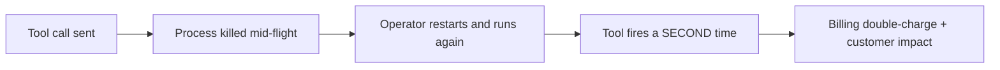
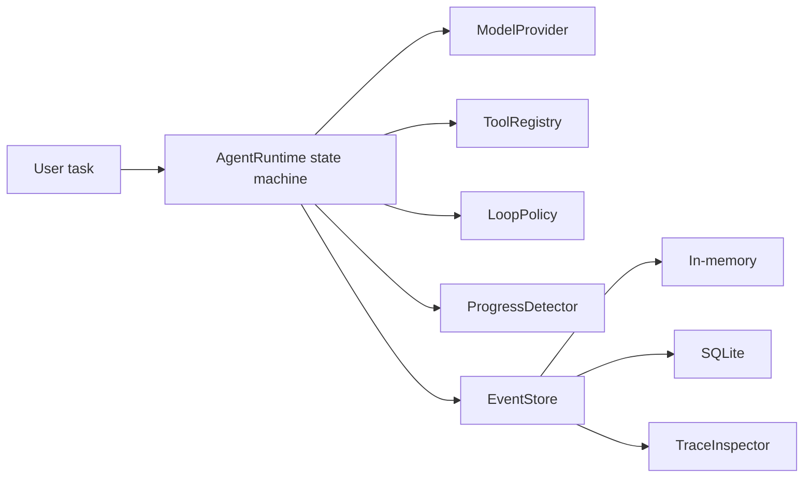

<div align="center">


# Soteria

**A provider-agnostic reliability runtime for bounded, observable, resumable, and replayable AI agent loops.**

*Bounded. Resumable. Provider-agnostic. Honest about why it stopped.*

**Soteria** is the open-source product. The agent runtime inside it is called **hernness** —
that is what you `pip install`, what the `hernness` CLI runs, and what the `HERNNESS_*`
environment variables configure.

</div>

---

## What is Soteria?

Soteria wraps a tool-using agent loop in a strict state machine, an append-only event
history, configurable safety policies, a provider-neutral interface, and a sandboxed
application-tools layer for file and shell work. Whether you build a coding agent, an ops
agent, a research agent, or long-running automation, Soteria answers the questions most
agent frameworks leave to chance:

1. What is the agent doing *right now*?
2. Why did this run stop?
3. Did it repeat itself without making progress?
4. Can an interrupted run continue safely?
5. Which tool calls actually executed?
6. Can the run be reproduced without calling a paid model again?

> �️ Soteria 0.1 is an **alpha foundation**. It is suitable for evaluation, deterministic
> testing, and local prototypes; it is **not production-ready**.

<div align="center">

[`Install`](#install) · [Quickstart](#quickstart) · [Configuration](#configuration) ·
[Providers](#providers) · [Application tools](#application-tools) · [CLI](#cli) ·
[Examples](#examples)

</div>

---

## Two names, one runtime

| Name | What it is | Where you see it |
|---|---|---|
| **Soteria** | The product / umbrella project | This README, the GitHub repo, the brand |
| **hernness** | The agent runtime you install | `pip install hernness`, `import hernness`, `hernness` CLI |
| **`HERNNESS_*`** | The runtime's environment variables | `HERNNESS_PROVIDER`, `HERNNESS_MODEL`, `HERNNESS_TOOLS_REQUIRE_APPROVAL`, … |
| **`hernness` command** | The runtime's CLI | `hernness doctor`, `hernness chat`, `hernness runs inspect …` |

Soteria is the product you evaluate; hernness is the runtime you install and run.

---

## Why a runtime for AI agents?

Most "agent frameworks" ship as a thin `while True` loop around a vendor SDK. Fast to
demo, brittle in production:

| Pain in a typical agent | What actually breaks | How hernness handles it |
|---|---|---|
| Repeated tool calls | `get_weather("Tokyo")` five times. | `repeated_action_limit=3` stops the run citing `StopReason.REPEATED_ACTION`. |
| Runaway token usage | Loop spins, bill surprises. | `max_total_tokens` + `max_runtime_seconds` enforce a hard upper bound; missing usage is flagged. |
| Provider lock-in | Switching vendors rewrites the agent. | `HERNNESS_PROVIDER` chooses `ollama` / `minimax` / `anthropic` / `openai` with no agent code change. |
| Process restart loses state | Restart, model re-asks, external tool fires twice. | `SQLiteEventStore` + `resume(run_id)` skips already-completed tool-call IDs. |
| No audit trail | "What did the agent actually do?" is unanswerable. | Every transition, call, and policy trigger is an immutable append-only event. |
| Stop reason is folklore | "Why did it stop?" has no answer. | One `StopReason` from a 13-value enum per terminal run. |
| Lost tool side effects | Crash between `TOOL_STARTED` and `TOOL_COMPLETED` replays or hides the call. | Resume refuses to proceed if a started tool has no durable result; you decide. |

The motivating incident timeline:



Hernness turns that into:

```mermaid
flowchart LR
    A[Tool call sent] --> B[TOOL_COMPLETED event persisted to SQLite]
    B --> C[Process killed mid-flight]
    C --> D[Operator resumes via runtime.resume&#40;run_id&#41;]
    D --> E[Already-completed tool-call ID skipped]
    E --> F[Tool fires exactly ONCE]
```



Proven by `tests/test_resume.py::test_interrupt_after_tool_result_resumes_without_duplicate_side_effect`.

---

## What you get



- **State machine**: 12 explicit states, 4 terminal (COMPLETED, FAILED, STOPPED, CANCELLED), every transition validated.
- **Event history**: append-only per-run log with sequence invariants.
- **Policies**: step, runtime, token, repetition, consecutive-error, no-progress, plus provider and tool timeouts.
- **Stores**: in-memory (tests) and SQLite (production runs).
- **Checkpoints** + `resume(run_id)` with completed-tool-call-ID tracking.
- **Provider-neutral** `ModelProvider` Protocol with built-in adapters for **Ollama**, **MiniMax**, **Anthropic**, and any **OpenAI-compatible** endpoint.
- **Deterministic** `FakeProvider` so tests never need an API key.
- **Traces** in chronological text or structured JSON.
- **Stop reason**: one of 13 enum values, persisted with every terminal run.
- **Optional long-term memory** via `LetheMemoryAdapter`.
- **Application tools**: workspace-scoped `read_file` / `write_file` / `edit_file` / `glob` / `grep` / `workspace_map` / `git_status`, sandboxed `run_shell`, planning, sub-agent `task`, and `web_fetch` / `web_search`.

---

## Install

Requires **Python 3.11+**. The core runtime depends only on **Pydantic**.

### From this repository

```bash
git clone https://github.com/Fqih/Soteria.git
cd Soteria
python -m pip install -e ".[dev]"
```

### Optional extras

| Extra | Adds | When you need it |
|---|---|---|
| `[dev]` | pytest, mypy, ruff, coverage | Local development + test runs |
| `[providers]` | `httpx` | Talking to MiniMax, Anthropic, or any OpenAI-compatible endpoint |
| `[sandbox]` | `docker` (docker-py) | Using `run_shell` against a real Docker daemon |
| `[live-benchmark]` | `httpx`, `matplotlib` | Running `python benchmark/run_benchmark.py` and reproducing case-study charts |
| `[mcp]` | `mcp` SDK | Authoring MCP servers or using SDK transports beyond stdio |

```bash
# Most common: providers + sandbox + dev tooling
python -m pip install -e ".[dev,providers,sandbox]"
```

`[sandbox]` is required only for the `run_shell` tool. Everything else (chat REPL,
`FakeProvider`, SQLite store, file tools) works without Docker.

### Verify the install

```bash
hernness doctor
```

This prints the resolved provider / model / endpoint without sending any HTTP request —
the cheapest possible smoke test.

---

## Configuration

Hernness is configured through the `HERNNESS_*` environment-variable family. Set them
once per shell (or persist to `~/.zshrc` / `~/.bashrc` via the `hernness chat` first-run
wizard) and every run picks them up.

### Environment variables

| Variable | Required | Purpose |
|---|---|---|
| `HERNNESS_PROVIDER` | yes | `ollama` \| `minimax` \| `anthropic` \| `openai` |
| `HERNNESS_MODEL` | yes | Default model name for the active provider |
| `HERNNESS_<PROVIDER>_API_KEY` | per provider | API key (omit for Ollama) |
| `HERNNESS_<PROVIDER>_BASE_URL` | no | Override endpoint URL |
| `HERNNESS_<PROVIDER>_MODEL` | no | Provider-specific model override |
| `HERNNESS_MINIMAX_API_STYLE` | no | `anthropic` (default) or `openai` |
| `HERNNESS_DATABASE_PATH` | no | SQLite path; empty = in-memory |
| `HERNNESS_MAX_TOTAL_TOKENS` | no | Override `LoopPolicy.max_total_tokens` |
| `HERNNESS_MAX_RUNTIME_SECONDS` | no | Override `LoopPolicy.max_runtime_seconds` |
| `HERNNESS_REPEATED_ACTION_LIMIT` | no | Override `LoopPolicy.repeated_action_limit` |
| `HERNNESS_PERMISSION_MODE` | no | `default` / `accept_edits` / `plan` / `bypass` |
| `HERNNESS_TOOLS_REQUIRE_APPROVAL` | no | Comma-separated tool names that gate on the approval callback |

### Pick a provider and export

| Provider | Local? | Needs API key | Default style |
|---|---|---|---|
| `ollama` | yes | no | `/api/chat` |
| `minimax` | no | yes | Anthropic-compatible |
| `anthropic` | no | yes | Anthropic Messages API |
| `openai` | no | yes | OpenAI Chat Completions |

```bash
# Ollama (local, no key)
export HERNNESS_PROVIDER=ollama
export HERNNESS_MODEL=llama3.1
# optional: export HERNNESS_OLLAMA_BASE_URL=http://localhost:11434

# MiniMax
export HERNNESS_PROVIDER=minimax
export HERNNESS_MODEL=MiniMax-M3
export HERNNESS_MINIMAX_API_KEY='paste-real-key-here'
# optional: export HERNNESS_MINIMAX_API_STYLE=anthropic   # or "openai"
# optional: export HERNNESS_MINIMAX_BASE_URL=https://api.minimax.io

# Anthropic
export HERNNESS_PROVIDER=anthropic
export HERNNESS_MODEL=claude-sonnet-4-6
export HERNNESS_ANTHROPIC_API_KEY='paste-real-key-here'

# OpenAI-compatible (any vendor exposing /v1/chat/completions)
export HERNNESS_PROVIDER=openai
export HERNNESS_MODEL=gpt-5.6
export HERNNESS_OPENAI_API_KEY='paste-real-key-here'
# optional: export HERNNESS_OPENAI_BASE_URL=https://api.openai.com/v1
```

Use `getpass` if you script the export. See [`.env.example`](.env.example) for a full
template — placeholders only, never commit real keys.

### Smoke-test

```bash
hernness doctor                       # verifies config without an HTTP call
hernness chat --workspace-root .      # interactive REPL, drives one run per input
```

On a fresh machine with no `HERNNESS_PROVIDER` set, `hernness chat` launches an
**interactive first-run wizard** that asks for the provider, hidden-prompt API key, and
model. At the end it offers (default **No**) to persist the variables to `~/.zshrc` or
`~/.bashrc` so subsequent shells see them automatically. Nothing is written unless you
type `y`/`yes`.

A single factory builds the right provider from the environment:

```python
from hernness.config import build_provider_from_env

provider = build_provider_from_env()  # raises ConfigError if anything required is missing
```

---

## Providers

Hernness ships with four built-in adapters. All read configuration through the
`HERNNESS_`-prefixed environment; agent code never touches URLs or keys directly.

| Provider | Adapter | Notes |
|---|---|---|
| Ollama | `OllamaProvider` | Local HTTP, no key. Default for offline development. |
| MiniMax | `MiniMaxProvider` | Anthropic-compatible (default) or OpenAI-compatible style. |
| Anthropic | `AnthropicProvider` | Native Anthropic Messages API. |
| OpenAI | `OpenAICompatibleProvider` | Any `/v1/chat/completions` endpoint — OpenAI, vLLM, llama.cpp, etc. |

Every adapter implements the same `ModelProvider` Protocol, so swapping providers is a
one-line change. `FakeProvider` records scripted `ModelResponse`s so tests never need an
API key:

```python
from hernness import AgentRuntime, FakeProvider, ModelResponse

runtime = AgentRuntime(
    provider=FakeProvider([
        ModelResponse(content="Hello from a scripted provider."),
    ]),
)
```

---

## Quickstart

One typed tool call, then a final reply, no API key required:

```python
import asyncio
from pydantic import BaseModel

from hernness import (
    AgentRuntime, FunctionTool, ModelResponse, TokenUsage, ToolCall,
)
from hernness.providers import FakeProvider


class AddArguments(BaseModel):
    left: int
    right: int


async def add(arguments: AddArguments) -> object:
    return {"sum": arguments.left + arguments.right}


async def main() -> None:
    provider = FakeProvider(
        [
            ModelResponse(
                tool_call=ToolCall(
                    tool_call_id="addition-1", name="add",
                    arguments={"left": 2, "right": 3},
                ),
                usage=TokenUsage(input_tokens=12, output_tokens=5),
            ),
            ModelResponse(
                content="The sum is 5.",
                usage=TokenUsage(input_tokens=18, output_tokens=6),
            ),
        ]
    )

    runtime = AgentRuntime(
        provider=provider,
        tools=[
            FunctionTool(
                name="add",
                description="Add two integers.",
                arguments_model=AddArguments,
                function=add,
            )
        ],
    )
    result = await runtime.run("What is 2 + 3?")
    print(result.status.value, result.stop_reason.value, result.output)


asyncio.run(main())
```

`examples/basic_agent.py` ships this runnable end-to-end.

---

## Application tools

`hernness.app_tools` is the optional-but-default toolkit for code-writing and ops agents.
All tools plug in via the existing `FunctionTool` / `ToolRegistry` contract — no change
to the runtime, the state machine, or the event log.

| Tool | Module | What it does |
|---|---|---|
| `read_file` | `file_tools.read_file_tool` | Read a file inside the active workspace. |
| `write_file` | `file_tools.write_file_tool` | Write (overwrite) a file inside the active workspace. |
| `edit_file` | `edit_file.edit_file_tool` | Surgical string replacement (requires unique match unless `replace_all=True`). |
| `glob` | `glob_tool.glob_tool` | Enumerate files matching a glob, paths returned relative to workspace root. |
| `grep` | `grep_tool.grep_tool` | Regex search with optional `include_glob` and `context_lines`. |
| `workspace_map` | `workspace_map.workspace_map_tool` | Compact file map + recently-modified files. |
| `git_status` | `git_status.git_status_tool` | Branch, modified files, optional untracked files. |
| `run_shell` | `shell_tool.run_shell_tool` | One shell command inside an ephemeral Docker container. |
| `plan_tasks` | `plan_tasks.plan_tasks_tool` | Declare / update / complete a structured execution plan. |
| `submit_plan` | `plan_tool.submit_plan_tool` | Record the active run's plan for `permission_mode=plan`. |
| `task` | `task_tool.task_tool` | Dispatch an isolated sub-agent run (`explore` or `general`). |
| `web_fetch` | `web_fetch.web_fetch_tool` | HTTP GET with a hard `max_bytes` cap; http/https only. |
| `web_search` | `web_search.web_search_tool` | Web search via DuckDuckGo HTML; no API key required. |

### Workspace safety

`Workspace(root).validate_path(...)` rejects `../`, symlink escapes, absolute-path
escapes, and null bytes **before** any I/O. `validate_for_write` also refuses to follow
symlinks at the leaf or any parent; `write_file` and `edit_file` open with `O_NOFOLLOW`
on POSIX as a second line of defense. There is no path the model can ask for that exits
the workspace root.

### Shell sandbox

`SandboxExecutor` wraps docker-py. Each `run_shell` call:

- creates a fresh container (`remove=True`),
- runs with `network_mode="none"` (default — fully offline),
- applies a `mem_limit` (default `256m`) and `cpu_quota` (default `50000`),
- times out via the runtime's `LoopPolicy.tool_timeout_seconds`,
- removes the container before returning.

`run_shell` **never** calls `subprocess` on the host. The sandbox is the only path to
the shell.

### Wiring tools into the runtime

```python
from contextlib import contextmanager

from hernness import AgentRuntime, FunctionTool
from hernness.app_tools.file_tools import bind_workspace, read_file_tool, write_file_tool
from hernness.app_tools.shell_tool import bind_sandbox, run_shell_tool
from hernness.app_tools.sandbox import SandboxExecutor
from hernness.app_tools.workspace import Workspace

workspace = Workspace("/srv/agent-workspace")
sandbox = SandboxExecutor(network_mode="none", mem_limit="256m")

with bind_workspace(workspace), bind_sandbox(sandbox):
    runtime = AgentRuntime(
        provider=provider,
        tools=[read_file_tool(), write_file_tool(), run_shell_tool()],
    )
    result = await runtime.run("Add a Makefile to the workspace root.")
```

The workspace binding is required — calling `read_file` / `write_file` / `run_shell`
outside a `bind_workspace(...)` block raises `WorkspaceNotBoundError` /
`SandboxNotBoundError`. This prevents the runtime from ever reaching the host filesystem
without an explicit workspace decision.

### Approval policy

`HERNNESS_TOOLS_REQUIRE_APPROVAL` is a comma- or whitespace-separated list of tool
names that must wait for explicit operator approval before the runtime executes them.
Tools not in the list are auto-approved without invoking any callback. For 0.1 the
built-in callback denies listed tools (returning `False` so the runtime stops with
`StopReason.POLICY_DENIED`); wrap with `on_require=...` to escalate to an interactive
prompter:

```python
from hernness.app_tools.approval import build_approval_callback

callback = build_approval_callback(
    on_require=lambda call: print(f"approving {call.name}({call.arguments})"),
)
runtime = AgentRuntime(provider=provider, tools=[...], approval_callback=callback)
```

---

## CLI

```bash
hernness [-d DATABASE] <command> [args]
```

| Command | What it does |
|---|---|
| `hernness doctor` | Verify `HERNNESS_*` configuration without an HTTP call. |
| `hernness chat [-d DATABASE] [--workspace-root PATH]` | Interactive REPL; one `AgentRuntime.run` per input. First run with no provider triggers the setup wizard. |
| `hernness runs list` | Print one line per run: `RUN_ID`, `STATE`, `STOP_REASON`, `STEPS`. |
| `hernness runs inspect RUN_ID` | Render the chronological trace (text). |
| `hernness runs resume RUN_ID` | Resume a persisted run whose latest checkpoint uses the built-in `FakeProvider` and has no pending tool call. |

The chat REPL accepts slash commands:

| Slash command | Action |
|---|---|
| `/provider` | Print provider / model / base URL / key-presence. |
| `/inspect RUN_ID` | Render a stored trace. |
| `/resume RUN_ID` | Resume a stored run. |
| `/skills` | List skills under `<workspace>/.soteria/skills`. |
| `/skill NAME` | Inject a skill body as the next user turn. |
| `/quit` / `/exit` | Exit the REPL. |

---

## Examples

`examples/` ships runnable Python files, all offline (no API key needed):

| File | Demonstrates |
|---|---|
| `examples/basic_agent.py` | One typed tool call followed by a final response. |
| `examples/repeated_action.py` | Deterministic repeated-action containment before the third side effect. |
| `examples/resume_after_interrupt.py` | Interrupt mid-flight, reopen SQLite, resume without replaying side effects. |
| `examples/app_tools_demo.py` | Workspace + file tools + permissive approval; walks the runtime through a one-step file edit. |
| `examples/live_providers/` | Real-API smoke tests for each provider (require `HERNNESS_*` keys). |

Run any of them:

```bash
python examples/basic_agent.py
python examples/repeated_action.py
python examples/resume_after_interrupt.py
python examples/app_tools_demo.py
```

---

## Development

```bash
python -m pip install -e ".[dev,providers,sandbox]"
ruff check .
ruff format --check .
mypy src/hernness
pytest
```

Quality gates (from `pyproject.toml`):

- **ruff** lint + format — line-length 100, strict per-file ignores for `examples/`, `benchmark/`.
- **mypy** strict on `src/hernness` (Pydantic plugin enabled).
- **pytest** `--strict-config --strict-markers`, asyncio mode auto.
- **coverage** branch coverage, fail-under 90%.

The `pytest` suite does not require Docker — `SandboxExecutor` accepts an injectable
client so the suite injects a fake and asserts the container configuration that would
be sent to docker. Live Docker integration is opt-in, same pattern as
`benchmark/live/tests/`.

---

## License

MIT — see [`LICENSE`](LICENSE).
